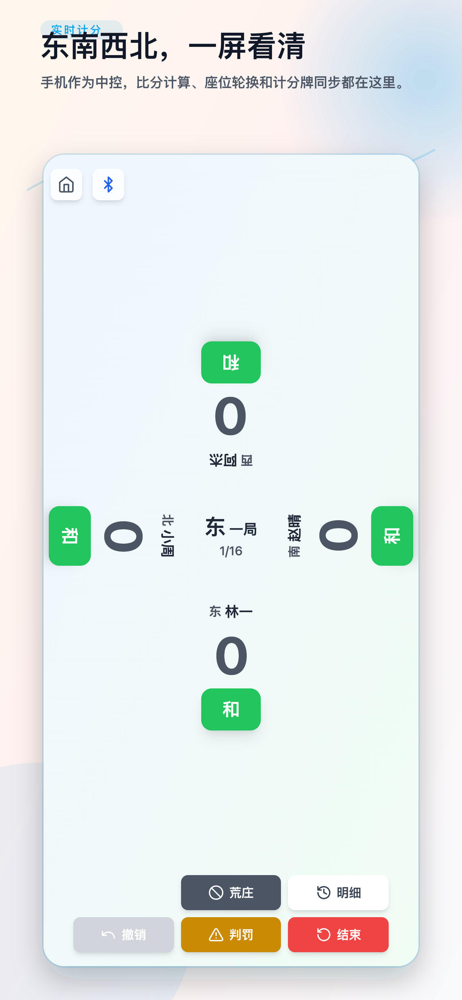
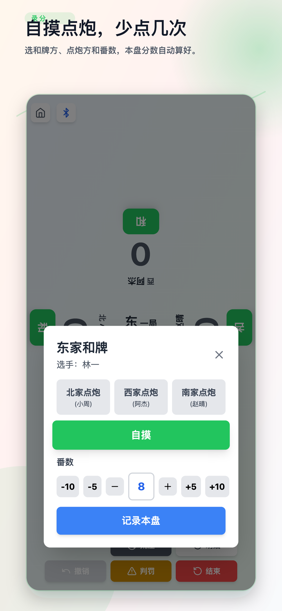
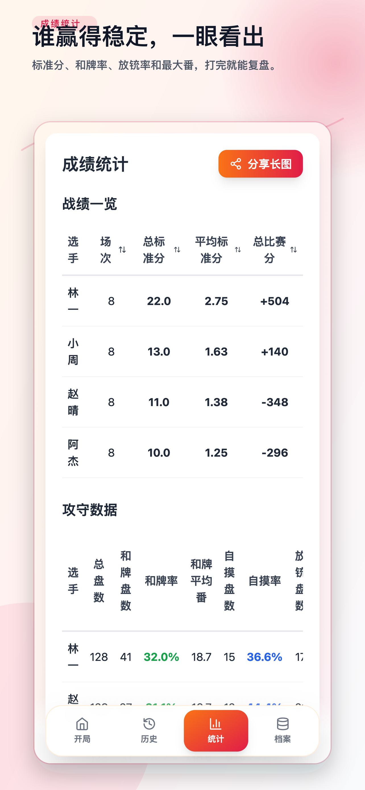

# 国标麻将实时计分板 · MjscoreBoard

> 一站式国标麻将 16 盘制比赛计分工具，支持 iOS / Android / Web，可选配 ESP32 蓝牙硬件计分板。


---

## 截图 Screenshots





---

## 功能特性 Features

- 🀄 **16 盘制国标麻将比赛计分** — 4 轮 × 4 盘，完整比赛流程管理
- 🔄 **自动座位轮换** — 每轮结束自动按规则轮换方位
- 🎯 **自摸 / 点炮 / 荒庄 / 裁判判罚** — 覆盖所有计分场景
- 📊 **实时四人分数显示** — 分数变化即时同步
- 📜 **比赛历史与复盘** — 完整的逐盘记录与详情回顾
- 🏆 **选手战绩统计** — 标准分、参赛场次、排名一目了然
- 📁 **多档案管理、分享、导入、合并** — 灵活的数据组织方式
- 🌍 **多语言支持 Multilingual** — 支持中、英、日三语全端热切换 (覆盖 App 到 ESP32 硬件)
- 📡 **BLE 蓝牙计分板连接** — 支持 ESP32 硬件和手机作为显示设备
- 🔒 **纯本地数据，无需注册，无广告** — 数据完全存储在设备本地

---

## 技术栈 Tech Stack

| 层 | 技术 |
|---|---|
| 前端 Frontend | React 18 + TypeScript + Vite |
| 移动端 Mobile | Capacitor (iOS + Android) |
| 数据库 Database | Dexie (IndexedDB) |
| BLE 蓝牙 | @capgo/capacitor-bluetooth-low-energy |
| 硬件 Hardware | ESP32-S3 + LovyanGFX + LVGL |
| UI 样式 | TailwindCSS + Lucide Icons |

---

## 快速开始 Getting Started

### 本地开发

```bash
git clone https://github.com/MarsNavi/MjscoreBoard.git
cd MjscoreBoard
npm install
npm run dev
```

### iOS 构建

```bash
npm run ios:build
npx cap open ios
```

### Android 构建

```bash
npm run android:build
npx cap open android
```

---

## ESP32 硬件计分板 ESP32 Hardware

本项目包含 ESP32-S3 固件源码，用于驱动 BLE 蓝牙连接的实体计分板。固件基于 LovyanGFX + LVGL 实现屏幕驱动与 UI 渲染，通过 BLE 与手机 App 实时同步比赛数据。

👉 详见 [`esp32/`](esp32/) 目录。

---

## 项目结构 Project Structure

```
src/           # React 前端源码
esp32/         # ESP32 固件源码
ios/           # iOS 原生壳
android/       # Android 原生壳
scripts/       # App Store 自动化脚本
```

---

## 许可证 License

本项目基于 [MIT](LICENSE) 许可证开源。
